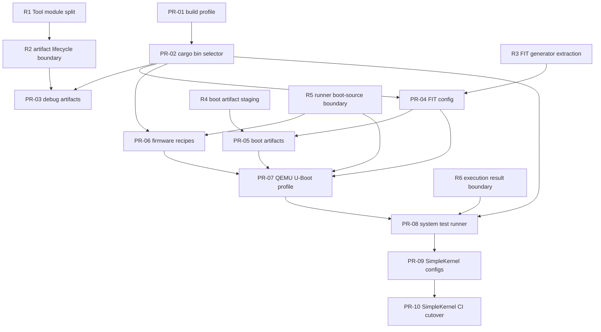

# 2026-05-06 SimpleKernel 迁移到 OSTool 的新特性计划

## 背景

目标是让 SimpleKernel 用 OSTool 替代当前 `xtask` 工具链，覆盖构建、QEMU/U-Boot
启动、固件准备、测试枚举和 CI 验证。

本文档只记录重构完成后的新特性计划。现有 OSTool 代码的架构整理、职责拆分和解耦工作放在
`2026-05-14-ostool-architecture-refactor-plan.md` 中，并且应先于本文档中的后续 feature PR 执行。

当前结论：

- OSTool 已经覆盖通用 Cargo 构建、QEMU 运行、U-Boot/FIT/TFTP/YMODEM、远端板卡
  server 和配置编辑等基础能力。
- SimpleKernel 的 `xtask` 里有一批更专用的 OS 启动链能力，OSTool 还不能无改动替代。
- 迁移应先完成 OSTool 现有架构重构，再在 OSTool 中补齐通用能力，最后到 SimpleKernel
  仓库增加配置和切换 CI。
- 用 OSTool 的 `Custom` 构建直接调用 SimpleKernel `xtask` 可以作为临时过渡，但不算
  真正替换工具链。

本文档按 feature 从轻到重排序，并给出建议分支名。分支名遵循 README 中的
`feature/amazing-feature` 示例，统一使用 `feature/` 前缀，并且只描述该分支要做的事。

## SimpleKernel 能力对比

| # | SimpleKernel 当前能力 | OSTool 当前支持情况 | 需要补的 feature | 建议 PR |
|---|---|---|---|---|
| 1 | 固定 nightly 工具链、`-Z build-std`、`riscv64gc-unknown-none-elf` 和 `aarch64-unknown-none` 双架构构建 | 部分支持。`Cargo` build 可以传 `target`、`args`、`env`，但 profile/debug/release 语义和 QEMU debug 绑定在一起 | 独立的 Cargo profile/release 配置，避免 `ostool build` 总是按运行调试模式推导 | PR-01 |
| 2 | `cargo xtask build/check` 分架构运行，CI 中还有 fmt、clippy、host test、deny | `build` 相关能力由 OSTool 覆盖；`check`、`clippy`、`fmt`、`deny`、host test 属于通用质量门禁，不纳入 OSTool 启动链 | SimpleKernel 侧继续在 CI/xtask 中直接调用 Cargo 或专用工具 | PR-09、PR-10 |
| 3 | 测试 crate 通过 `[[bin]]` 自动发现，每个 test binary 可单独构建运行 | 不足。OSTool 主要按 package/default_run/最后一个 bin 推导 artifact，缺少显式 `--bin` 选择 | Cargo bin selector：支持 `package`/`bin` 精确选择可运行 binary artifact | PR-02 |
| 4 | 每次构建后生成 `.objdump`、`.readelf`、`.nm`、`.bin` 等调试产物 | 部分支持。OSTool 有 ELF 到 BIN 的 objcopy，但没有完整调试产物流水线；调试产物需要先等重构计划中的 artifact/object-tools 边界完成 | Debug artifact pipeline：基于重构后的 artifact/object-tools 边界生成调试产物 | PR-03 |
| 5 | RISC-V 固件链：OpenSBI + U-Boot SPL + `u-boot.itb` | 不支持。OSTool 当前没有固件 recipe 管理 | Firmware recipe executor：声明式 prebuilt/build 命令、产物路径、缺失时构建 | PR-06 |
| 6 | AArch64 固件链：U-Boot + OP-TEE + Arm Trusted Firmware `flash.bin` | 不支持。同 PR-06 | 同上，需要能表达多步骤依赖和架构分支 | PR-06 |
| 7 | QEMU 不是简单 `-kernel`，而是按架构通过 U-Boot/ATF/SPL 引导 | 部分支持。OSTool QEMU runner 会自动追加 `-kernel`，还缺少“不自动 kernel”的 boot profile | QEMU boot profile：允许关闭自动 `-kernel`，配置 `-bios`、loader、drive、monitor、log、TFTP 等 | PR-07 |
| 8 | QEMU 启动前先 dump DTB，再生成 FIT、boot script、TFTP 文件和 boot partition/rootfs | 部分支持。OSTool 有 `dtb_dump` 和 U-Boot FIT，但不是 SimpleKernel 需要的连续启动产物链 | Boot artifact pipeline：DTB dump -> FIT -> boot script -> TFTP/boot dir/rootfs | PR-05 |
| 9 | FIT 镜像使用内核 ELF，`os = "elf"`，按架构设置 `arch`、`load`、`entry` 和 FDT | 部分支持。`fitimage` 库能表达这些字段，但 OSTool U-Boot runner 目前更偏 raw bin/Linux 默认 | 对外暴露 FIT image config：ELF/BIN 输入、`os`、`arch`、`load`、`entry`、FDT | PR-04 |
| 10 | `cargo xtask test --list/--name/--all --timeout` 自动扫描并顺序运行 QEMU system tests | 不支持。OSTool 没有 SimpleKernel 这种系统测试 runner | `ostool test` 或等价 test runner：发现、构建、运行、捕获日志、汇总退出码 | PR-08 |
| 11 | CI 对 PR 跑 3 次 system test，对 push/release 跑 10 次，超时和日志清晰 | 部分支持。QEMU/UBoot runner 有 timeout 和 regex，但没有 repeat/system-test 汇总语义 | Test repeat、per-test timeout、success/fail summary、失败日志保留 | PR-08 |
| 12 | Dev Container 固定 OS 开发依赖：QEMU、U-Boot tools、cross toolchains、mdbook、cargo-deny 等 | OSTool 仓库不负责 SimpleKernel 容器，但要保证功能可在容器内使用 | SimpleKernel 侧添加 OSTool 安装/固定版本和配置文件，CI 先双跑再切换 | PR-09、PR-10 |
| 13 | 真实开发板路径暂不是 SimpleKernel CI 主路径，但未来可能复用 U-Boot/TFTP/serial | OSTool 已有 board server、远端串口、TFTP 文件和电源管理 | 本轮迁移不阻塞。只需保证新增 FIT/UBoot 配置也能被 board runner 复用 | PR-04、PR-05 |

## 建议 PR 顺序

| 顺序 | 建议分支名 | 目标仓库 | 重量 | 主要内容 | 依赖 | 验收标准 |
|---|---|---|---|---|---|---|
| PR-01 | `feature/build-profile-config` | OSTool | 轻 | 给 Cargo build 增加独立 profile/release/debug 配置，解耦 QEMU debug 和 Cargo release | 无 | 旧 `.build.toml` 行为不变；新增配置能分别产生 debug/release artifact |
| PR-02 | `feature/cargo-bin-selector` | OSTool | 轻到中 | 增加 Cargo bin selector，支持配置和命令行按 `package`、`bin` 精确选择可运行 binary artifact | PR-01 | 能用配置或 CLI 表达 SimpleKernel 单个 test binary 构建；多 binary 未指定时给出明确错误；旧单 binary 配置兼容 |
| PR-03 | `feature/debug-artifact-pipeline` | OSTool | 中 | 基于重构后的 artifact/object-tools 边界，默认生成 `disassembly` 和 `elf_info` 文件，并与 ELF 放在一起；后续再按需要扩展 nm/bin 调试产物 | PR-02、R1、R2 | 对一个 bare-metal ELF 默认生成 `<elf-stem>.disassembly` 和 `<elf-stem>.elf_info`，路径稳定可被后续步骤引用；不依赖宿主机 binutils |
| PR-04 | `feature/fit-image-config` | OSTool | 中 | 将 `fitimage` 能力暴露到 OSTool 配置：输入 ELF/BIN、`os`、`arch`、`load`、`entry`、FDT | PR-02、R3 | 能生成 SimpleKernel 风格 `os = "elf"` 的 FIT；现有 U-Boot runner 默认配置兼容 |
| PR-05 | `feature/boot-artifact-pipeline` | OSTool | 中 | 增加 boot artifact pipeline：QEMU dump DTB、FIT、boot script、TFTP/boot dir/rootfs 产物准备 | PR-04、R4 | 不启动 QEMU 也能只生成完整 boot artifacts；产物路径可配置且可清理 |
| PR-06 | `feature/firmware-recipes` | OSTool | 中到重 | 增加 firmware recipe：架构分支、多步骤命令、产物检查、缺失时构建、跳过已存在产物 | PR-02、R5 | 能表达 RISC-V OpenSBI/U-Boot 和 AArch64 U-Boot/OP-TEE/ATF 的依赖链；dry-run/unit test 覆盖缺失产物判断 |
| PR-07 | `feature/qemu-uboot-profile` | OSTool | 重 | 增加 QEMU U-Boot boot profile：关闭自动 `-kernel`，配置 `-bios`、loader、drive、monitor、log、TFTP/rootfs | PR-04、PR-05、PR-06、R5 | 能用 OSTool 从 U-Boot/ATF/SPL 路径启动一个 SimpleKernel QEMU smoke；保留当前简单 `-kernel` 模式兼容 |
| PR-08 | `feature/system-test-runner` | OSTool | 重 | 增加系统测试 runner：扫描 `[[bin]]`、`--list`、`--name`、`--all`、repeat、timeout、日志捕获和汇总 | PR-02、PR-07、R6 | 能替代 `cargo xtask test --arch <arch> --name heap-test --timeout 30`；失败时给出 test 名、退出码和尾部日志 |
| PR-09 | `feature/ostool-configs` | SimpleKernel | 中 | 在 SimpleKernel 增加 OSTool 配置、Dev Container/CI 中固定 OSTool 来源，保留 `xtask`/CI 对 check、clippy、fmt、deny、host test 的直接调用 | PR-01 到 PR-08 | SimpleKernel 内能用 OSTool 跑至少一个 RISC-V 和一个 AArch64 smoke test；CI 可选择性双跑 |
| PR-10 | `feature/ostool-ci-cutover` | SimpleKernel | 重 | 将 SimpleKernel CI 和文档主路径切到 OSTool，删除或降级 `xtask` 为兼容入口 | PR-09 且双跑稳定 | PR 路径重复测试、push/release 重复测试与原 `xtask` 等价；文档明确 OSTool 为默认工具链 |

## PR-01 实现取舍记录

PR-01 的目标不是给 OSTool 增加新的调试流程，而是把两个原本耦合在一起的维度拆开：

- Cargo 构建 profile：`Debug` / `Release` 影响优化级别、`debug_assertions`、代码体积和最终
  二进制形态。
- QEMU debug 模式：`ostool run qemu --debug` 只应表达 QEMU/GDB 运行时调试参数，例如
  `-s -S`。

已采用的最小实现：

- 在 `system.Cargo` 下增加可选字段 `profile = "Debug" | "Release"`。
- `profile` 只选择 Cargo 的 dev/release profile，不直接配置 `opt-level`、`lto`、
  `codegen-units` 等优化细节；这些仍由被构建项目自己的 `Cargo.toml` 负责。
- 未配置 `profile` 时保留旧行为：QEMU `--debug` 使用 Cargo Debug，其它构建/运行使用
  Cargo Release，保证旧 `.build.toml` 不需要迁移。
- `log/max_level_*` 和 `log/release_max_level_*` 的自动 feature 选择跟随实际 Cargo
  profile，而不是继续跟随 QEMU debug 标志。
- README 示例改用 `profile = "Release"` 表达 release 构建，`args` 继续用于 `-Z
  build-std` 等普通 Cargo 参数。

明确没有纳入 PR-01 的内容：

- 不增加 `--build-profile` 之类 CLI 覆盖参数，避免同时维护配置优先级和命令行优先级。
- 不支持 Cargo 自定义 named profile，例如 `--profile dev-fast`。SimpleKernel 当前迁移只需要
  Debug/Release 两个标签；自定义 profile 可在后续有明确需求时单独设计。
- 不在 OSTool 中管理优化级别本身。SimpleKernel 这类内核项目应该继续在自己的
  `[profile.dev]` / `[profile.release]` 中定义优化策略。
- 不修改 SimpleKernel 配置和 CI。PR-01 只补齐 OSTool 的通用表达能力，SimpleKernel 侧接入放到
  PR-09/PR-10。

这个取舍能覆盖 SimpleKernel 当前的四种组合：Debug 正常运行、Release 正常运行、Debug +
QEMU debug、Release + QEMU debug，同时保持 OSTool 既有配置兼容。

## PR-02 实现取舍记录

PR-02 的目标收敛为 Cargo binary artifact 选择，不把 `check/clippy` 这类通用质量门禁纳入
OSTool。

采用这个拆分的原因：

- SimpleKernel 迁移最先遇到的阻塞是系统测试 crate 里有多个 `[[bin]]`，需要能稳定构建和运行
  某一个 test binary。这个问题可以通过 Cargo 的 package/bin 选择解决，不需要先引入新的命令
  抽象。
- `check`、`clippy`、`fmt`、`deny`、host test 这类命令没有可运行 ELF artifact，也不参与
  QEMU/U-Boot/board 启动链；纳入 OSTool 会迫使 build 层处理“无 artifact”分支，削弱工具定位。
- binary 选择是 Cargo 语法和 artifact 解析问题，不是 OS 语义检查问题。OSTool build 层只需要按
  Cargo 元数据和 JSON 输出找到可执行 artifact，不应该理解 SimpleKernel 测试用例的内部语义。
- `ostool test` 或后续 system-test runner 才适合处理测试发现、筛选、repeat、timeout 和日志汇总；
  这些不应塞进 Cargo build builder。

已采用的最小实现：

- 在 `system.Cargo` 下增加可选字段 `bin = "..."`，含义是 Cargo binary target 名称。
- 配置里的 `package = "..."` 仍然保留为必填字段，`bin` 是可选字段。`package` 用于确定 Cargo
  workspace 中的目标 package、package-local 配置路径、feature/target 推导和 `${package}` 变量替换。
- `ostool build`、`ostool run qemu`、`ostool run uboot`、`ostool board run` 增加
  `--package <name>` 和 `--bin <name>` 临时覆盖参数。
- 命令行覆盖可以只指定一个字段：只传 `--bin` 时使用配置中的 `package`；只传 `--package` 时使用该
  package 的 `default-run`、唯一 binary，或在多 binary 时返回明确歧义错误。
- 命令行覆盖后的 Cargo 配置需要同步回 `Tool` 运行上下文，确保后续加载 `.board.toml` 时
  `${package}` 等变量按覆盖后的 package 解析；否则 `board run --package ...` 可能仍使用旧
  package 的 DTB 或其它 package-local 路径。
- Cargo builder 调用 `cargo build --package <package>`，在配置或 CLI 提供 `bin` 时追加
  `--bin <bin>`。
- 构建完成后从 Cargo JSON message 中按 package id 和 binary target name 解析 executable artifact；
  不再依赖“最后一个 bin artifact”这类不稳定推导。
- 未指定 `bin` 时，解析顺序是：唯一 binary、Cargo `default-run`、否则多 binary 歧义错误。

用法变化：

```toml
[system.Cargo]
package = "simplekernel-tests"
bin = "heap-test"
```

也可以保持配置不变，在一次命令里临时选择：

```bash
ostool build --bin heap-test
ostool run qemu --package simplekernel-tests --bin heap-test
ostool board run --package simplekernel-tests --bin heap-test
```

多个二进制文件不需要强制写多份配置。推荐做法是：

- 同一个 package 下只是切换 test binary 时，保留一份配置，用 `--bin <name>` 临时选择。
- 不同 package、不同 QEMU/U-Boot/board 参数或不同产物目录需要长期固定时，再拆成多份配置。

这里的 `bin` 不是操作系统 PATH 上的二进制路径，也不是文件名查找规则。它是 Cargo binary target
名称，可以来自 `[[bin]] name = "..."`，也可以来自 Cargo 对 `src/bin/<name>.rs` 的默认 target
命名。OSTool 把这个名字交给 Cargo，并从 Cargo JSON 输出里读取最终 executable 路径。

明确没有纳入 PR-02 的内容：

- 不实现 `cargo check`、`cargo clippy`、`cargo fmt`、`cargo deny` 的统一命令选择；这些保留在
  SimpleKernel CI/xtask 或项目自己的质量门禁脚本中。
- 不做 SimpleKernel 测试语义检查，例如判断某个 binary 是否真的是系统测试、是否包含指定测试入口。
  这类语义属于 SimpleKernel 或后续 test runner，不属于 OSTool 的通用 Cargo build 层。
- 不把 `bin` 设计成文件路径。OSTool 只消费 Cargo 产出的 executable artifact，避免绕开 Cargo target
  解析规则。
- 不要求用户为每个 binary 复制配置。配置提供默认值，CLI 覆盖提供一次性选择。

这个取舍让 PR-02 只解决 “选择哪个 Cargo binary artifact” 这一件事，和 PR-01 的 `profile`
字段可以并存为：

```toml
[system.Cargo]
package = "simplekernel-tests"
profile = "Release"
bin = "heap-test"
```

## 重构前置说明

原计划中的 PR-02B 不再作为本文档中的 feature PR 维护。它已经移动到
`2026-05-14-ostool-architecture-refactor-plan.md`，作为 R1 `Tool module split`。

后续 feature 的依赖关系统一写成 `R* + PR-*`：

- `R*` 表示先修架构重构，只解决现有代码的结构和边界问题。
- `PR-*` 表示本文档中的用户可见能力或 SimpleKernel 迁移能力。
- 如果 feature 实现时发现还需要额外解耦，应先新增一个小的 `R*` 切片，而不是把重构混进
  feature PR。

## 依赖关系



## 分阶段迁移检查点

### A. 构建能力可用

完成 PR-01、PR-02、R1、R2 和 PR-03 后，OSTool 应能覆盖 SimpleKernel 的可运行 artifact
构建和调试产物生成。R1/R2 本身不是用户可见能力，但它们把 `Tool`、产物状态和 object tools
边界整理出来，避免 PR-03 把新的 debug artifact 逻辑继续塞进过大的 `tool.rs`。
`check/clippy/fmt/deny/host test` 不进入 OSTool，继续由 SimpleKernel CI/xtask 直接调用。
这个阶段不要改 SimpleKernel 默认 CI，只做本地或实验性配置验证。

### B. 启动产物可用

完成 R3、R4、R5 和 PR-04 到 PR-07 后，OSTool 应能准备固件、DTB、FIT、boot script、
TFTP/rootfs，并通过 QEMU 的 U-Boot/ATF/SPL 链路启动 SimpleKernel。这个阶段可以开始在
SimpleKernel 侧加入非默认配置。

### C. 系统测试可用

完成 R6 和 PR-08 后，OSTool 应能表达 SimpleKernel 当前 `xtask test` 的核心语义：
自动发现测试、按名称运行、全量运行、repeat、timeout、日志捕获和汇总退出码。

### D. SimpleKernel 切换

PR-09 先双跑或保留 `xtask` fallback。PR-10 再把文档和 CI 默认路径切换到 OSTool。
只有在 RISC-V 和 AArch64 的 QEMU system tests 都达到原 CI 重复次数后，才建议删除或弱化
`xtask`。

## 每个 PR 的通用约束

- 保持现有 OSTool 配置向后兼容；新字段应有默认值。
- 用户可见 CLI、配置格式或工作流变化，需要同步 README/README.en.md 或局部文档。
- 操作敏感路径如 QEMU、U-Boot、TFTP、serial、board server 要有单元测试或记录过的手动验证。
- 不要求贡献者在本地宿主机安装额外工具；验证优先使用仓库 CI、Docker 或 Dev Container。
- SimpleKernel 侧切换前，应保留 `xtask` 作为对照路径，直到 OSTool QEMU system tests 达到等价结果。
