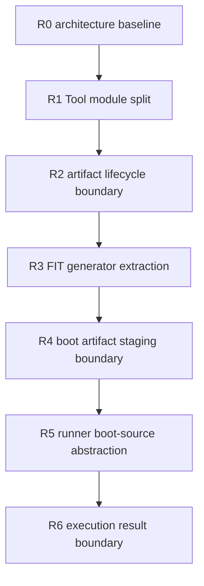

# 2026-05-14 OSTool 架构重构前置计划

## 定位

本文档是 SimpleKernel 迁移新特性之前的架构重构计划。它只面向 OSTool 现有代码，
目标是先解决职责膨胀、产物状态混用和 runner 边界不清的问题，再进入
`2026-05-06-simplekernel-ostool-migration-pr-plan.md` 中的新特性开发。

重构阶段的原则：

- 默认保持现有 CLI、配置格式和 public API 兼容；如果旧接口阻碍更清晰的架构模型，可以新增
  更合理的新接口，并把旧接口标记为 deprecated，保留一个过渡期后再移除。
- 用户可见接口变更必须写清迁移路径：旧接口如何映射到新接口、废弃原因、推荐替代写法，以及
  预计在哪个后续版本或阶段移除旧接口。
- 不改变 `ostool build`、`ostool run qemu`、`ostool run uboot`、`ostool board run`
  的核心用户意图；具体参数、字段或 public API 可以按上面的废弃策略演进。
- 不新增 SimpleKernel 专用 feature。
- 每个重构 PR 都要能独立 review，且优先用现有单元测试和最小 contract test 证明行为等价或
  证明旧接口到新接口的迁移关系。
- 不要求贡献者在 macOS 宿主机安装额外工具；验证优先使用仓库 CI、Docker 或 Dev Container。

## 接口兼容与废弃策略

R0 之后的重构不要求完美冻结所有旧接口，但必须先分类：

| 等级 | 含义 | 处理方式 |
|---|---|---|
| 硬兼容 contract | 用户意图、默认工作流、真实设备安全边界、已公开且仍合理的配置语义 | 重构 PR 必须保持行为等价，并用测试或手动验证记录证明 |
| 软兼容 / 可废弃 contract | 旧字段、旧参数、旧 public API 能工作，但命名或语义已经阻碍新模型 | 新增替代接口；旧接口保留并标记 deprecated；README/计划文档说明迁移路径 |
| 内部实现 contract | 模块布局、私有结构体、内部 helper、runner 内部阶段 | 可以在重构 PR 中直接调整，但要保护外部行为 |
| 文档漂移 | README 或旧计划与当前代码不一致 | R0 记录并在合适 PR 中修正文档；不要把漂移文本当成当前行为真相 |

Rust public API 优先用 `#[deprecated(note = "...")]` 标记过时接口。CLI/config 的废弃应通过
README、配置示例、解析提示或 warning 说明，不要静默改变含义。

## 本地计划与上游 PR 边界

本文档和迁移计划可以正常保留在本地 checkout 或个人 fork 中，服务于长期规划。它们不需要成为
架构重构的阻塞约束。真正向上游提交 PR 前，只需要检查 `git status`、`git diff upstream/main...HEAD`
和 staged diff，确保本地计划、`AGENTS.md`、临时记录等无关 fork 侧资料没有混入上游 PR。

## 阶段文档索引

本文保留总览、阶段顺序和每个阶段的主目标。某个阶段的 contract、验证记录或执行细节变大时，
拆到阶段文档中，执行时按需加载。

| 阶段 | 阶段文档 | 加载时机 |
|---|---|---|
| R0 | `docs/fork-only/2026-05-14-ostool-r0-contract-baseline.md` | 开始任何代码移动前；需要确认现有行为边界或 Docker 验证基线时 |
| R1-R6 | 暂留在本文档 | 对应阶段开始前，如果细节继续膨胀，再拆出独立阶段文档 |

## 当前主要架构问题

| 编号 | 位置 | 问题 | 影响 | 先修动作 |
|---|---|---|---|---|
| A1 | `ostool/src/tool.rs` | `Tool` 文件同时承载门面、manifest、命令执行、artifact、build config、变量替换、menuconfig hooks | 后续 debug artifacts、object tools、boot artifacts 继续加入会让核心文件不可维护 | R1 |
| A2 | `ostool/src/ctx.rs` | `OutputArtifacts` 只有 `elf`、`bin`、`cargo_artifact_dir`、`runtime_artifact_dir`，没有区分 Cargo 原始产物、runner 消费产物和调试产物 | PR-03 容易把 `.disassembly/.elf_info/.nm` 混进 runtime `.bin` 语义 | R2 |
| A3 | `ostool/src/tool.rs` 与 `ostool/src/build/cargo_builder.rs` | someboot 自动参数在 build config 准备和 Cargo command 构造阶段都有注入入口 | 责任边界不清，未来引入 build plan 后容易重复追加参数 | R2 |
| A4 | `ostool/src/build/cargo_builder.rs` | `CargoBuilder::execute()` 串起 pre hook、Cargo JSON 解析、artifact 选择、runtime objcopy、post hook | build lifecycle 缺少可复用阶段，debug artifact pipeline 只能硬插 | R2 |
| A5 | `ostool/src/run/uboot.rs` | FIT image 生成嵌在 U-Boot runner 内，并带有 Linux/raw-bin 默认假设 | SimpleKernel 需要 `os = "elf"`、ELF 输入、架构化 load/entry/FDT 配置，不能只靠 runner 内部逻辑扩展 | R3 |
| A6 | `ostool/src/run/qemu.rs` | QEMU 命令组装和执行耦合，默认自动追加 `-kernel`，DTB dump 路径也写在 run 阶段 | 后续 QEMU U-Boot/ATF/SPL profile 需要关闭 kernel loader 并复用 boot artifacts | R5 |
| A7 | `pre_build_cmds`/`post_build_cmds` | 当前只有字符串 hook，可执行但不可表达 recipe 依赖、产物检查、skip 和 dry-run | 固件 recipe 如果直接塞进 shell hook，会丢失可测试的结构化语义 | R4、R5 后再做 feature |
| A8 | `sterm`、`output_matcher`、QEMU/U-Boot runner | timeout、regex match、日志和退出结果分散在 runner 过程内 | system test runner 需要可汇总的 test result，而不是只拿到一个运行错误 | R6 |

## 重构依赖关系

## 从小到大的执行顺序

| 顺序 | 建议分支名 | 重量 | 类型 | 主要内容 | 解锁的新特性 |
|---|---|---|---|---|---|
| R0 | `feature/architecture-baseline` | 轻 | 文档/测试基线 | 固化现有 build/run/board 行为边界和需要保留的 contract | 后续全部重构 |
| R1 | `feature/tool-module-split` | 轻到中 | 纯结构 | 拆分 `tool.rs` 职责，不改行为 | F03 debug artifacts |
| R2 | `feature/artifact-lifecycle-boundary` | 中 | 结构/状态模型 | 明确 Cargo artifact、runtime artifact、debug artifact 边界；收敛 someboot 参数注入责任 | F03 debug artifacts |
| R3 | `feature/fit-generator-extract` | 中 | 结构/服务抽取 | 从 U-Boot runner 抽出 FIT 生成服务 | F04 FIT config |
| R4 | `feature/boot-artifact-staging` | 中 | 结构/流水线边界 | 抽出 prepare-only boot artifacts staging 边界 | F05 boot artifact pipeline |
| R5 | `feature/runner-boot-source` | 中到重 | runner 边界 | 抽出 QEMU/U-Boot boot source 与 command plan | F07 QEMU U-Boot profile、F06 firmware recipes |
| R6 | `feature/execution-result-boundary` | 中 | 运行结果模型 | 抽出日志、timeout、regex match 和 runner result 汇总边界 | F08 system test runner |

## R0：架构基线和 contract 清单

目标：在任何代码移动前，明确现有行为哪些必须保持、哪些可以通过 deprecated 路径替换、哪些只是
内部实现细节。

R0 的详细 contract 清单、Docker 复核记录和查漏补缺结论见：
`docs/fork-only/2026-05-14-ostool-r0-contract-baseline.md`。

R0 复核后的关键修正：

- `system.Custom` 要拆成两个 contract：`ostool build` 只执行 `build_cmd`；run/board 的 runtime
  artifact 准备路径会再次执行 `build_cmd`，再按 `elf_path` 和 `to_bin` 准备产物。
- 当前没有纯 QEMU command-plan seam。`-kernel`、UEFI、`dtb_dump` 等命令组装与进程启动耦合在
  runner 内；R0 只能记录现状和手动/集成验证，R5 的第一步才适合抽出可测 command plan。
- CLI 覆盖不应只看 `board` 子命令；`build`、`run qemu`、`run uboot` 和独立的 `cargo-osrun`
  parser 都属于重构前 contract。
- Cargo executable artifact 选择、profile/log-level feature、变量替换、public API、board
  session release/heartbeat/retry 是 R1/R2 之前需要显式保护或记录的边界。

验收：

- 文档中列出 R1-R6 每一步要保护、可废弃或可内部调整的旧行为。
- 执行代码重构前，先用当前 CI 命令作为等价验证基线：
  - `cargo fmt --all -- --check`
  - `cargo clippy --target x86_64-unknown-linux-gnu --all-features`
  - `cargo build --target x86_64-unknown-linux-gnu --all-features`
  - `cargo test --target x86_64-unknown-linux-gnu -- --nocapture`
- Docker 复现 CI 时要补齐 Node 24、pnpm 10.33.0、QEMU、U-Boot tools 和 `libudev-dev`。
  不要用 `apt --no-install-recommends` 缩减 QEMU/U-Boot 包；否则会缺 `dtc` 或 QEMU ROM/firmware，
  得到与 CI 不等价的失败。
- 2026-05-14 的 Docker 复核里，全量 `cargo test` 在
  `ostool-server/tests/session_ws_lifecycle.rs::abrupt_ws_drop_powers_off_and_releases_session`
  卡住，没有形成全仓库 green baseline。R0/R1 结论不能把这条写成已通过；需要作为独立测试稳定性问题
  跟进或在 CI 中确认。
- 无法在本机或 CI 复现的硬件/board-server 行为，要明确写成“未验证，需要真实环境验证”，不能用
  host-only 测试替代真实证明。

## R1：拆分 `Tool` 内部模块

目标：把 `ostool/src/tool.rs` 从大文件拆成内部模块，只移动代码，不改变行为。

建议文件布局：

- 保留：`ostool/src/tool.rs`
  - `ToolConfig`
  - `Tool`
  - `ManifestContext`
  - `Tool::new()`
  - `ctx()`、`ctx_mut()`、`into_context()`
  - 对外 re-export 或内部模块挂载
- 新增：`ostool/src/tool/manifest.rs`
  - `resolve_manifest_context()`
  - manifest path 解析
  - `metadata()`
  - `resolve_package_manifest_dir()`
- 新增：`ostool/src/tool/command.rs`
  - `command()`
  - `shell_run_cmd()`
- 新增：`ostool/src/tool/artifacts.rs`
  - `set_elf_artifact_path()`
  - `prepare_elf_artifact()`
  - `objcopy_elf()`
  - `objcopy_output_bin()`
- 新增：`ostool/src/tool/build_config.rs`
  - `resolve_build_config_path()`
  - `prepare_build_config()`
  - 当前 someboot 参数注入逻辑先原样迁移，不在 R1 改语义
- 新增：`ostool/src/tool/variables.rs`
  - `replace_value()`
  - `replace_string()`
  - `replace_path_variables()`
  - `package_root_for_variables()`
- 新增：`ostool/src/tool/config_hooks.rs`
  - `ui_hooks()`
  - feature/package/target select hooks
  - `collect_feature_options()`
  - `collect_package_doc_targets()`
  - `collect_rustup_targets()`

明确不做：

- 不新增 `debug_artifacts` 配置。
- 不调用 `rust-objdump`、`rust-readobj`、`rust-nm`。
- 不修改 `to_bin` 语义。
- 不重写 `Tool` 公开 API。

验收：

- `cargo test -p ostool`
- `cargo check -p ostool`
- 现有 `ostool build`、`ostool run qemu`、`ostool run uboot`、`ostool board run`
  配置入口保持不变。

## R2：artifact 生命周期和 object-tools 边界

目标：把产物状态从“几个路径字段”升级为清晰生命周期，但仍不新增用户可见 debug artifact feature。

建议修改：

- 在 `ostool/src/ctx.rs` 中重新整理 artifact 状态，至少区分：
  - Cargo 原始 executable artifact。
  - runner 当前消费的 ELF/BIN。
  - runtime artifact directory。
  - 未来 debug artifacts registry。
- 在 `ostool/src/tool/artifacts.rs` 中保留 runtime `.bin` 语义，明确 `to_bin` 只表示 runner 可消费
  的 raw binary。
- 新增内部 object tools 边界，例如 `ostool/src/tool/object_tools.rs`，只负责定位和调用 Rust
  toolchain 中的 object tools；R2 可以先只放接口和单元测试，不生成实际 debug artifacts。
- 收敛 someboot 参数注入责任：不要同时在 build config 准备阶段和 Cargo command 构造阶段追加
  同一类自动参数。建议把“最终 Cargo build plan”作为唯一注入点。
- 把 `CargoBuilder::handle_output()` 整理为更明确的阶段：
  - 记录 Cargo 原始 artifact。
  - 同步 runner artifact。
  - 按 `to_bin` 生成 runtime `.bin`。
  - 给后续 debug artifact pipeline 留独立 post-build hook。

明确不做：

- 不默认生成 `.disassembly`、`.elf_info`、`.nm`。
- 不改变现有 `.bin` 输出路径。
- 不要求 host binutils。

验收：

- 原有 build/run 测试通过。
- 针对 artifact state 增加单元测试：设置 ELF 后，Cargo artifact、runtime artifact 和 arch
  detection 结果符合旧行为。
- 针对 someboot 参数增加回归测试：同一自动参数不会被重复追加。

## R3：抽出 FIT generator

目标：把 FIT image 生成从 U-Boot runner 内部抽成可复用服务，为后续 FIT 配置 feature 做准备。

建议修改：

- 新增 `ostool/src/boot/fit.rs` 或 `ostool/src/run/fit.rs`。
- 定义内部 `FitInput` / `FitBuildPlan` / `GeneratedFitImage` 之类的纯数据结构。
- 把当前 `Runner::generate_fit_image()` 中的文件读取、`fitimage` crate 调用、输出路径写入迁移出来。
- U-Boot runner 继续用默认值调用该服务，保持当前默认行为：
  - 默认输出 `image.fit`。
  - 默认 kernel component type 仍兼容原有行为。
  - 默认没有配置时仍走原有 U-Boot runner 路径。
- 把当前 `todo!()` 架构分支改成明确错误，避免 unsupported arch panic。

明确不做：

- 不在配置文件暴露 FIT 字段。
- 不切换 SimpleKernel 的 `os = "elf"` 语义。
- 不改变 TFTP/YMODEM staging 行为。

验收：

- 新增 FIT generator 单元测试，验证 AArch64/RISC-V arch 映射和 unsupported arch 错误。
- U-Boot runner 现有 FIT 相关测试继续通过。

## R4：boot artifact staging 边界

目标：把“准备启动产物”和“启动 runner”拆开，形成 prepare-only 能力的内部边界。

建议修改：

- 新增 `ostool/src/boot/artifacts.rs` 或 `ostool/src/boot/pipeline.rs`。
- 定义内部 stage：
  - DTB dump artifact。
  - FIT artifact。
  - boot script artifact。
  - TFTP staged artifact。
  - boot dir/rootfs artifact。
- 每个 stage 返回结构化结果，而不是只在 runner 里临时拼路径。
- QEMU 当前 `dtb_dump` 行为先迁移到这个 staging 边界后再由 runner 调用。
- U-Boot runner 当前 local/remote staging 先保持 backend 行为不变，只让 FIT 路径来源变成 staging result。

明确不做：

- 不新增 `ostool prepare` 命令。
- 不新增用户配置字段。
- 不实现完整 SimpleKernel boot partition/rootfs 规则。

验收：

- 单元测试覆盖 stage 输出路径和清理策略。
- QEMU `dtb_dump` 旧行为保持兼容。
- U-Boot local/remote FIT staging 旧行为保持兼容。

## R5：runner boot-source 抽象

目标：把 runner 的“启动源选择”和“进程/串口执行”拆开，让 QEMU 能表达非 `-kernel` 启动。

建议修改：

- 在 QEMU runner 中引入内部 `QemuCommandPlan`：
  - executable。
  - machine。
  - debug args。
  - firmware args。
  - kernel loader args。
  - drive/loader/monitor/log args。
- 引入内部 `BootSource` 或等价结构：
  - KernelElf。
  - KernelBin。
  - UefiPflash。
  - FirmwareChain。
  - ExternalArgsOnly。
- 当前默认行为仍生成 `KernelElf` 或 `KernelBin`，并追加 `-kernel`。
- UEFI 逻辑改成一种 boot source，而不是在命令构造中临时把 `use_kernel_loader` 置 false。
- U-Boot runner 的 FIT boot source 也通过内部 plan 组织，减少 FIT 生成、staging、bootcmd 拼接混在一起的状态。

明确不做：

- 不暴露 QEMU U-Boot profile 配置。
- 不实现 `-bios`、loader、drive 的新用户配置。
- 不改 U-Boot local/remote backend 协议。

验收：

- 单元测试覆盖默认 `-kernel` 行为、UEFI 禁用 `-kernel` 行为。
- 现有 QEMU run 测试继续通过。
- 现有 U-Boot bootcmd/TFTP/YMODEM 测试继续通过。

## R6：执行结果、日志和 timeout 边界

目标：为 system test runner 准备可复用的运行结果模型，但不新增 `ostool test`。

建议修改：

- 新增 `ostool/src/run/execution.rs` 或等价模块。
- 定义内部结果结构：
  - runner name。
  - exit status。
  - matched success/fail regex。
  - timeout 信息。
  - stdout/stderr 或 tail log 摘要。
  - elapsed time。
- QEMU 和 U-Boot runner 继续对外返回 `anyhow::Result<()>`，但内部先构造结构化结果。
- `output_matcher` 和 `sterm` 的 timeout 语义保持不变，只把结果汇总逻辑移出 runner 主流程。

明确不做：

- 不新增 `ostool test`。
- 不实现 repeat。
- 不扫描 Cargo `[[bin]]`。

验收：

- timeout 为 `None`、`0`、正数的旧行为保持不变。
- success/fail regex 命中时的返回结果保持不变。
- 新增单元测试覆盖 result summary 的构造。

## 与新特性计划的关系

重构完成后，再进入新特性计划：

| 重构项 | 解锁 feature |
|---|---|
| R1、R2 | F03 debug artifact pipeline |
| R3 | F04 FIT image config |
| R4 | F05 boot artifact pipeline |
| R5 | F06 firmware recipes、F07 QEMU U-Boot profile |
| R6 | F08 system test runner |

如果某个 feature 在实现时发现还需要额外架构调整，应先新增一个小的 `R*` 重构切片，而不是把结构调整
混进 feature PR。

## 不纳入本轮重构的范围

- 不重构 `ostool-server/webui`。
- 不重写 board server API。
- 不把 `check`、`clippy`、`fmt`、`deny`、host test 纳入 OSTool。
- 不删除 `xtask` 或改变 SimpleKernel CI。
- 不引入新的宿主机工具链安装要求。
