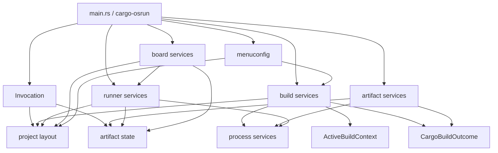

# R1 Invocation 架构实施计划

> **给智能协作执行者的说明：** 逐项执行本文档时使用 `superpowers:executing-plans`。只有用户明确要求时才使用 subagents；如果使用，按独立文件所有权拆分任务，阻塞性的集成和最终收口留在本地主线完成。

## 目标

R1 的目标是移除 `Tool` 作为中心业务对象的架构，把一次 OSTool 调用拆成更清晰的 invocation 模型，同时保持 CLI、配置格式和运行时行为不变。

核心思路：

- `ProjectLayout` 保存不可变的项目路径事实。
- `InvocationOptions` 保存一次命令调用的静态选项。
- `InvocationState` 保存一次命令执行期间产生的可变状态。
- `Invocation` 只组合 layout/options/state，不承载 build/run/menuconfig 业务行为。
- build、artifact、runner、board、menuconfig 通过明确的模块函数或确实有状态的结构体协作。
- build pipeline 返回事实结果，不直接改全局 invocation state。
- runtime artifact preparation 独立于 Cargo artifact 选择，为后续 debug artifact pipeline 留出边界。
- R1 采用保守切片执行：允许 `Tool` 在中间阶段暂时作为兼容门面存在，但每个切片都必须让它变薄，最终删除。

技术栈保持现状：Rust、Clap、Tokio、Cargo metadata JSON messages、`object`、`jkconfig`，以及现有 OSTool build/run/board 模块。

---

## 1. 范围和兼容性定位

R1 是一次较大的内部架构重构。以下用户可见 contract 必须保持不变：

- `ostool build`
- `ostool run qemu`
- `ostool run uboot`
- `ostool board run`
- `ostool menuconfig`
- `cargo-osrun`
- `.build.toml`、`.qemu.toml`、`.uboot.toml`、`.board.toml`
- 当前变量替换语义：`${workspace}`、`${workspaceFolder}`、`${package}`、`${tmpDir}`、`${env:VAR}`
- 当前 runtime `.elf` / `.bin` 准备语义，包括 `to_bin`
- 当前 QEMU、U-Boot、board、serial、TFTP 和电源管理副作用

R1 可以破坏围绕 `Tool` 的 Rust library API：

- `Tool`
- `ToolConfig`
- `ManifestContext`
- `AppContext`
- `OutputArtifacts`
- `ostool::ctx`

这个破坏只在 fork-side 架构重构模式下成立。如果后续准备提交上游 PR，必须在开工前选择兼容模式。

### 1.1 兼容模式开关

R1 开工前必须明确采用哪一种模式：

| 模式 | 含义 | 执行要求 |
|---|---|---|
| Fork-side mode | 本 fork 内部架构重构，`Tool` 相关 Rust API 可一次性移除或改名 | CLI/config/runtime 行为硬兼容；PR 或提交说明写清这是 internal API reset |
| Upstream-friendly mode | 计划直接面向上游 review | 保留 deprecated wrapper/re-export，或者先确认上游接受 breaking Rust API |

如果没有新的用户指令，当前文档默认按 **Fork-side mode** 执行。

R1 明确不做：

- 不新增 `debug_artifacts` 配置。
- 不调用 `rust-objdump`、`rust-readobj` 或 `rust-nm`。
- 不改变 `to_bin` 语义。
- 不改变 Cargo executable artifact 选择规则。
- 不改变 someboot 自动参数语义；重复注入风险留到 R2。
- 不改变 QEMU、U-Boot、board、serial、TFTP 或电源管理副作用。
- 不把 generic `check`、`clippy`、`fmt`、`deny` 或 host-test 质量门禁塞进 OSTool。

## 2. 防代码膨胀和过度设计约束

`ostool/src/tool.rs` 当前约 1300 行。这个体量本身不是必须重构的理由。R1 的理由是 `Tool` 被跨模块 `impl Tool` 当成万能对象，导致 build、run、artifact、config、variable 都能互相触碰状态。

因此 R1 不追求文件数量增加，也不追求把一个文件拆成很多层。R1 的成功标准是净复杂度下降：

- 共享可变状态减少。
- 跨模块 `impl Tool` 消失。
- build outcome、runtime artifact、process context 等关键 seam 可测试。
- 调用方拿到的是窄输入和返回值，而不是万能对象。
- 中间阶段允许 `Tool` 作为兼容门面，但只能调用新 helper，不能新增业务逻辑。

### 2.1 文件和对象预算

执行 R1 时必须遵守以下预算：

- 不预创建完整目录树。只在当前切片需要时创建文件。
- 只有一个函数的 helper，优先留在现有模块或单个 `mod.rs` 中；等职责变成两个以上再拆文件。
- 无状态逻辑默认使用 module-level function，不创建 `*Service`、`*Factory`、`*Runner` 空壳对象。
- 只有持有真实状态、资源、lifetime boundary 或测试 seam 时，才引入 struct。
- 只有存在多个实现或明确 mock seam 时，才引入 trait。
- R1 相关生产代码如果净增超过约 20%-30%，必须在 review 中说明换来的真实收益；否则优先删减抽象。

推荐形态：

```rust
artifact_selector::select_executable_artifact(...)
project::variables::replace_string(scope, input)
process::run_shell_command(ctx, cmd)
```

避免形态：

```rust
ArtifactSelector::new().select(...)
VariableExpander::new().replace(...)
ShellCommandRunner::new().run(...)
```

除非这些对象确实持有状态或作为测试 seam。

### 2.2 保守切片不降低完整目标

“保守切片”不是缩小 R1 目标，而是让每一步都能编译、验证和回滚。完整目标仍然是：

- `Tool` 不再是核心模型。
- 跨模块 `impl Tool` 消失。
- `Invocation` 不成为新中心对象。
- Cargo executable resolution、runtime artifact preparation、runner execution 通过显式输入协作。

保守切片的执行方式是：

1. 先补行为护栏。
2. 再抽纯事实和纯函数。
3. 再抽返回值 seam。
4. 再迁移调用方。
5. 最后删除 `Tool` 和 `ctx`。

中间状态允许 `Tool` 暂时存在，但每个切片都必须满足：

- `Tool` 的业务职责减少。
- 不新增新的 `impl Tool` 业务方法。
- 新代码可以被旧 `Tool` 门面调用，但最终调用方向应从 `Tool -> helper` 迁移到 `Invocation/orchestration -> helper`。

## 3. 为什么必须移除 `Tool`

`Tool` 当前把多个概念压成一个可变对象：

- project discovery：manifest path、manifest dir、workspace dir。
- invocation options：build dir、bin dir、debug mode。
- invocation state：arch、build config path、build config、artifacts。
- command construction 和 shell execution。
- variable expansion。
- build config loading 和 menu hooks。
- runtime artifact preparation。
- 通过 `CargoBuilder` 编排 Cargo build。
- 通过跨模块 `impl Tool` 提供 QEMU、U-Boot、board、menuconfig 门面。

直接问题不是 `tool.rs` 文件长，而是 `Tool` 太方便传递，任何模块都能继续给它挂行为。R1 要消除这个中心吸力，而不是把 `tool.rs` 机械拆成多个继续 `impl Tool` 的小文件。

## 4. 目标概念

### 4.1 `ProjectLayout`

表示当前操作项目的不可变路径事实。

```rust
pub(crate) struct ProjectLayout {
    manifest_path: PathBuf,
    manifest_dir: PathBuf,
    workspace_dir: PathBuf,
}
```

职责：

- 从显式路径或当前目录解析 Cargo manifest。
- 保存 canonical package manifest path。
- 保存 package manifest directory。
- 保存 Cargo workspace root。

非职责：

- 不保存 build config。
- 不保存 arch。
- 不保存 artifacts。
- 不执行命令。

### 4.2 `InvocationOptions`

表示一次 OSTool 调用的静态选项。

```rust
pub(crate) struct InvocationOptions {
    manifest: Option<PathBuf>,
    build_dir: Option<PathBuf>,
    bin_dir: Option<PathBuf>,
    debug: bool,
}
```

`manifest` 只用于 layout resolution。`build_dir`、`bin_dir` 和 `debug` 是一次 invocation 内稳定的默认值。

### 4.3 `InvocationState`

表示一次 invocation 执行过程中产生的可变状态。

```rust
pub(crate) struct InvocationState {
    arch: Option<object::Architecture>,
    active_build: Option<ActiveBuildContext>,
    artifacts: OutputArtifacts,
}
```

`InvocationState` 替代 `AppContext`。名字刻意使用 `State`，避免后续把任何依赖都塞进泛化的 `Context`。

要求：

- 字段保持 private。
- 只能通过小方法更新，例如 `set_arch`、`set_active_build`、`set_cargo_artifact`、`set_runtime_artifact`。
- service 优先接收自己需要的窄输入，不应因为方便而借用或克隆整个 `Invocation`。
- build pipeline 不直接写 `InvocationState`；它返回 outcome，由 orchestration 层更新 state。

### 4.4 `Invocation`

表示一次命令执行 session。

```rust
pub(crate) struct Invocation {
    layout: ProjectLayout,
    options: InvocationOptions,
    state: InvocationState,
}
```

职责：

- 从 `InvocationOptions` 创建 `ProjectLayout`。
- 拥有 `InvocationState`。
- 提供少量访问器，例如 `layout()`、`options()`、`state()`、`state_mut()`、`build_dir()`、`bin_dir()`。

非职责：

- 不负责 Cargo build lifecycle。
- 不负责 runtime artifact preparation。
- 不负责 QEMU/U-Boot/board execution。
- 不负责 config loading。
- 不负责 variable expansion 逻辑。

`Invocation` 不能变成新版 `Tool`。业务行为不得通过跨模块 `impl Invocation` 扩展。

### 4.5 `ActiveBuildContext`、`ActiveCargoBuild` 和 `VariableScope`

表示 CLI override 已经应用后的最终 build 状态。

```rust
pub(crate) enum ActiveBuildContext {
    Cargo(ActiveCargoBuild),
    Custom(ActiveCustomBuild),
}

pub(crate) struct ActiveCargoBuild {
    config: Cargo,
    config_path: Option<PathBuf>,
    package_dir: PathBuf,
    variable_scope: VariableScope,
}

pub(crate) struct ActiveCustomBuild {
    config: Custom,
    config_path: Option<PathBuf>,
    variable_scope: VariableScope,
}

pub(crate) struct VariableScope {
    workspace_dir: PathBuf,
    package_dir: PathBuf,
    tmp_dir: PathBuf,
}
```

职责：

- 保存 CLI override 后的最终 build config。
- 保存 build config path，用于 relative `extra_config` 和 shell hooks。
- 为 `${package}` 提供单一真相源。
- 避免从某个过期的 `BuildConfig` 副本重新推导 package dir。

关键规则：

- `--package` / `--bin` override 必须在创建 `ActiveCargoBuild` 前应用。
- 创建 `ActiveCargoBuild` 后，不再修改其中的 `Cargo` 语义字段。
- variable expansion 只读 `VariableScope`。
- 没有 active build 时，使用从 `ProjectLayout` 派生的 default `VariableScope`。

### 4.6 `CargoBuildOutcome`

Cargo build pipeline 返回构建事实，不直接修改 invocation state。

```rust
pub(crate) struct CargoBuildOutcome {
    executable: ResolvedCargoArtifact,
}

pub(crate) struct ResolvedCargoArtifact {
    elf_path: PathBuf,
    cargo_artifact_dir: PathBuf,
}
```

职责：

- 表示 Cargo JSON message 中解析出的 executable artifact。
- 保持 artifact selection 规则稳定。
- 给 runtime preparation 提供输入。

非职责：

- 不保存 runner runtime `.elf` / `.bin`。
- 不保存未来 debug artifacts。
- 不决定 QEMU/U-Boot/board 行为。

### 4.7 `ProcessContext`

变量替换、命令构造和 shell hook 需要明确输入，而不是依赖 `Tool`。

```rust
pub(crate) struct ProcessContext<'a> {
    workdir: &'a Path,
    workspace_dir: &'a Path,
    variables: &'a VariableScope,
    kernel_elf: Option<&'a Path>,
}
```

要求：

- `command()` 使用 `workdir` 作为工作目录。
- `WORKSPACE_FOLDER` env 行为保持当前语义。
- 参数和 env 值通过 `VariableScope` 替换。
- shell hook 在已有 runtime ELF 时继续注入 `KERNEL_ELF`。
- `KERNEL_ELF` 不只属于 Cargo post-build；当前所有 `shell_run_cmd()` 在 artifact 存在时都会注入它，R1 不应缩小这个语义。

### 4.8 Rust API 形态规则

R1 应使用 Rust-native 模块边界，不要为了“看起来抽象”到处创建 nominal service object。

- 没有 owned state、resource、cache 或 lifetime boundary 时，优先使用 module-level functions。
- `CargoBuildPipeline`、`RuntimeArtifactPreparer`、`QemuRunner` 等结构体只有在确实持有执行状态或依赖时才创建。
- 只有存在多个实现或明确测试 seam 时才新增 trait。
- 避免结构体长期持有很多 `&mut` 引用；优先显式函数参数和短 borrow scope。
- 命名描述领域操作，不描述空泛模式。例如 `artifact_selector::select_executable_artifact` 优于无状态的 `ArtifactSelector` 对象。

## 5. 允许的目标拓扑

下面是 R1 完成后允许出现的模块拓扑，不是一次性创建清单。执行时仍遵守文件和对象预算：
只在当前切片需要时创建文件；一个 helper 足够时留在现有模块或单个 `mod.rs`；无状态逻辑优先用
module-level function。

```text
ostool/src/
  lib.rs                         [modify] 更新导出；移除 `tool` 作为中心模块
  main.rs                        [modify] 创建 `Invocation`，调用显式服务
  invocation.rs                  [create when needed] Invocation, InvocationOptions, InvocationState

  ctx.rs                         [delete in R1h] AppContext 角色迁移到 InvocationState；OutputArtifacts 迁移到 artifact/state.rs
  tool.rs                        [delete in R1h] 移除 Tool, ToolConfig, ManifestContext

  project/                       [create only as helpers accumulate] project discovery 和项目本地 helper
    mod.rs                       [create when needed]
    layout.rs                    [create when needed] ProjectLayout, resolve_project_layout()
    metadata.rs                  [create when needed] cargo metadata、package lookup、package manifest dir
    variables.rs                 [create when needed] VariableScope 和变量替换 helper

  process/                       [create only as helpers accumulate] process context、command construction、shell execution
    mod.rs                       [create when needed]
    command.rs                   [optional] command construction helpers
    shell.rs                     [optional] shell command execution helpers

  artifact/                      [create only as helpers accumulate] runtime artifact state 和 preparation
    mod.rs                       [create when needed]
    state.rs                     [create when needed] OutputArtifacts
    runtime.rs                   [create when needed] RuntimeArtifactPreparer, PreparedRuntimeArtifacts

  build/
    mod.rs                       [modify] 暴露明确 build functions/types，不再 `impl Tool`
    config.rs                    [keep] R1 不改用户可见配置语义
    someboot.rs                  [keep] R1 不改 someboot 语义
    cargo_builder.rs             [delete or rename in R1d/R1h] 改为 cargo_pipeline.rs 或 module function
    cargo_pipeline.rs            [create when needed] CargoBuildPipeline / run_cargo_build()
    artifact_selector.rs         [create when needed] Cargo JSON executable artifact selection
    config_loader.rs             [create when needed] BuildConfigLoader 或 module functions
    config_hooks.rs              [create when needed] jkconfig hooks for build config

  run/
    mod.rs                       [modify] runner entrypoints 不再依赖 Tool
    qemu.rs                      [modify] 显式 QEMU API；可保留有状态 QemuRunner
    uboot.rs                     [modify] 显式 U-Boot API；可保留有状态 UbootRunner
    tftp.rs                      [modify] 接收 concrete layout/artifact/process inputs
    output_matcher.rs            [keep]
    shell_init.rs                [keep]
    ovmf_prebuilt/               [keep]

  board/
    mod.rs                       [modify] 显式 BoardRunner 或 board functions
    config.rs                    [modify] 使用变量替换 helper，不依赖 Tool
    global_config.rs             [keep]
    client.rs                    [keep]
    session.rs                   [keep]
    serial_stream.rs             [keep]
    terminal.rs                  [keep]
    config_tui.rs                [keep]

  menuconfig.rs                  [modify] 使用 BuildConfigLoader/config hooks
  logger.rs                      [keep]
  sterm/mod.rs                   [keep]
  utils.rs                       [modify] 保留通用 helper；命令/变量相关逻辑迁出
  bin/cargo-osrun.rs             [modify] 创建 Invocation，调用 artifact/runner services
```

测试和文档：

```text
ostool/tests/public_api.rs                  [modify] 不再断言 Tool-centered API
ostool/tests/ui/pass_tool_configs.rs        [delete or rewrite] 只保留有意支持的新 API
ostool/tests/ui/fail_cargo_builder.rs       [modify] cargo pipeline privacy check
ostool/tests/ui/*.stderr                    [modify] 更新 trybuild expected output
ostool/tests/qemu_byte_stream.rs            [keep]

docs/fork-only/2026-05-14-ostool-architecture-refactor-plan.md  [modify] 链接 R1 完成状态
```

## 6. 依赖方向

R1 应形成以下依赖方向：



禁止依赖：

- 任何模块都不应新增带业务行为的 `impl Invocation`。
- service API 不应在窄输入足够时接收 `&Invocation` 或 `&mut Invocation`。
- `CargoBuildPipeline` 不应接收 `&mut InvocationState`。
- build pipeline 返回 `CargoBuildOutcome`，由 orchestration 层更新 `InvocationState`。
- runner 模块不依赖 build config loading。
- build config loading 不依赖 QEMU/U-Boot runner execution。
- variable expansion 不修改 `InvocationState`。
- command construction 不知道 build-system-specific 语义。

## 7. 实施计划

R1 按 R1a-R1i 保守切片执行。切片编号是执行顺序，不改变最终完整目标。

### 任务 1 / R1a：先补 contract tests，再移动代码

**文件：**

- Modify: `ostool/src/main.rs`
- Modify: `ostool/src/bin/cargo-osrun.rs`
- Modify: `ostool/tests/public_api.rs`
- Keep unchanged until R1h: `ostool/tests/ui/pass_tool_configs.rs`
- Add or move tests near: `project::variables`、`build::artifact_selector`、`artifact::runtime`、`process`

步骤：

- [x] 补 `ostool build --config --package --bin` parser tests。
- [x] 补 `ostool run qemu --config --qemu-config --debug --dtb-dump --package --bin` parser tests。
- [x] 补 `ostool run uboot --config --uboot-config --package --bin` parser tests。
- [x] 补 global `--manifest` parser tests。
- [x] 补 `cargo-osrun` parser tests：default QEMU、`uboot`、`--to-bin`、`--no-run`、`--build-dir`、`--bin-dir`。
- [x] 补 Cargo artifact selector tests：显式 `bin`、package 同名 bin、`default-run`、single bin、多 bin ambiguity。
- [x] 补 variable replacement tests：`${workspace}`、`${workspaceFolder}`、`${package}`、`${tmpDir}`、`${env:VAR}`、missing env -> empty string。
- [x] 补 process context tests：workdir、`WORKSPACE_FOLDER`、arg/env replacement。
- [x] 补 shell context tests：runtime ELF 存在时 shell hook 注入 `KERNEL_ELF`。
- [x] 补 runtime artifact state tests：Cargo artifact path 和 custom ELF path 的旧行为等价。
- [x] 保留现有 public API trybuild expectations；R1a 只记录当前 `Tool` API 基线，不提前接受 API break。
- [x] Run `cargo test -p ostool public_api`。
- [x] Run parser/selector 相关最小测试。
- [x] Run variable/process/artifact 相关最小测试。

审查重点：

- 测试必须证明行为，不做 source grep。
- 不应无意创建新的 stable Rust API promise。
- 不应提前修改 `Tool` / `ctx` public API expectations；API reset 只在 R1h 发生。
- selector 和 variable/process tests 是 R1 的行为护栏，不应推迟到 R2。

当前完成记录（2026-05-14）：

- 已新增主 CLI parser tests、`cargo-osrun` parser tests 和 Cargo executable artifact selector tests。
- 已补齐变量替换、进程 env、shell hook 和 Cargo artifact state 行为测试。
- 已用 Docker `rust:1.90-bookworm` 验证：
  - `cargo test -p ostool parse_`
  - `cargo test -p ostool select_executable_artifact`
  - `cargo fmt --all -- --check`
  - `cargo test -p ostool public_api`
  - `cargo test -p ostool --lib`
- host 上没有 `cargo`，验证通过容器内 `/usr/local/cargo/bin` 工具链执行；容器内补了 `pkg-config` 和
  `libudev-dev`，格式检查需临时安装 `rustfmt` component。

### 任务 2 / R1b：引入 Project、VariableScope 和兼容门面

**文件：**

- Create: `ostool/src/invocation.rs`
- Create: `ostool/src/project/mod.rs`
- Create: `ostool/src/project/layout.rs`
- Create: `ostool/src/project/metadata.rs`
- Create or keep local: `ostool/src/project/variables.rs`
- Create or keep local: `ostool/src/process/mod.rs`
- Modify: `ostool/src/lib.rs`
- Modify: `ostool/src/main.rs`
- Modify: `ostool/src/bin/cargo-osrun.rs`

步骤：

- [x] 把 manifest path resolution 移到 `project/layout.rs`。
- [x] 把 `ManifestContext` 语义重命名为 `ProjectLayout`。
- [x] 把 package metadata lookup 移到 `project/metadata.rs`。
- [x] 引入 `InvocationOptions`、`InvocationState` 和 `Invocation`。
- [x] 保持 `ProjectLayout`、`InvocationOptions`、`InvocationState`、`Invocation` 字段 private。
- [x] 引入 `ActiveBuildContext`、`ActiveCargoBuild`、`ActiveCustomBuild`、`VariableScope` 和 `ProcessContext`。
- [x] 先让现有 `Tool` 门面调用这些新 helper；本切片不要求删除 `Tool`。
- [x] 确认 `Tool` 没有新增业务职责，只是转发到新 helper。
- [x] 用 invocation constructor 替代 `init_tool()`。
- [x] 替换 `cargo-osrun` 里的 `resolve_manifest_context()` 用法。
- [x] Run `cargo check -p ostool`。

审查重点：

- `ProjectLayout` 创建后不可变。
- `InvocationState` 只保存 mutable runtime state。
- `Invocation` 不增长 build/run/menuconfig 方法。
- `${package}` 状态必须来自 `VariableScope`，不能来自某个过期 `BuildConfig` 副本。
- 中间阶段的 `Tool` 只能变薄，不能新增业务逻辑。

### 任务 3 / R1c：抽出 variable 和 process functions

**文件：**

- Create or modify: `ostool/src/project/variables.rs`
- Create or modify: `ostool/src/process/mod.rs`
- Optional create only when needed: `ostool/src/process/command.rs`
- Optional create only when needed: `ostool/src/process/shell.rs`
- Modify: `ostool/src/utils.rs`
- Modify: `ostool/src/run/qemu.rs`
- Modify: `ostool/src/run/uboot.rs`
- Modify: `ostool/src/board/config.rs`

步骤：

- [x] 把 `${workspace}`、`${workspaceFolder}`、`${package}`、`${tmpDir}`、`${env:VAR}` 替换移到 `project::variables`。
- [x] variable expansion 接收 `&VariableScope`；无 active build 时从 `ProjectLayout` 派生 default scope。
- [x] 引入 `ProcessContext`，显式保存 workdir、workspace_dir、VariableScope、kernel_elf。
- [x] 把 command construction 移到 `process` 模块；只有函数数量和职责膨胀时才拆 `process::command`。
- [x] 把 shell command execution 移到 `process` 模块；只有函数数量和职责膨胀时才拆 `process::shell`。
- [ ] 替换 `Tool::replace_string`、`Tool::replace_path_variables`、`Tool::command`、`Tool::shell_run_cmd` call sites。
- [x] 保持 shell hook 的 `KERNEL_ELF` 注入语义。
- [x] Run variable/process tests。
- [x] Run `cargo check -p ostool`。

当前完成记录（2026-05-14）：

- 已新增 `project`、`process`、`invocation` 模块，`Tool` 对 manifest/metadata/变量/命令执行的逻辑已转发到新 helper。
- 主 CLI 的 `init_tool()` 和 `cargo-osrun` 已改用 `Invocation` constructor 建立项目布局。
- runner/board/config 调用点仍通过 `Tool` 兼容门面进入新 helper；直接替换 call site 留到 R1g/R1h 清理。
- 已用 Docker `rust:1.90-bookworm` 验证：
  - `cargo fmt --all -- --check`
  - `cargo check -p ostool`
  - `cargo test -p ostool --lib`

审查重点：

- 缺失环境变量仍替换为空字符串。
- `${package}` 仍在 build config 已激活时使用 selected Cargo package dir。
- command working directory 保持当前 `Tool::command` 行为。
- `WORKSPACE_FOLDER` env 行为保持不变。
- command/shell helpers 接收 concrete `ProcessContext`，不接 whole `Invocation`。
- 不创建无状态 `CommandFactory` 或 `ShellCommandRunner`。

### 任务 4 / R1d：抽出 Cargo build outcome seam，并保留 legacy runtime adapter

**文件：**

- Create: `ostool/src/build/artifact_selector.rs`
- Create or rename: `ostool/src/build/cargo_pipeline.rs`
- Delete or stop using: `ostool/src/build/cargo_builder.rs`
- Modify: `ostool/src/build/mod.rs`
- Modify: `ostool/src/main.rs`
- Modify: `ostool/tests/ui/fail_cargo_builder.rs`

步骤：

- [x] 把 Cargo JSON executable selection 移到 `artifact_selector.rs`。
- [x] 定义 `ResolvedCargoArtifact` 和 `CargoBuildOutcome`。
- [x] 把 `CargoBuilder` lifecycle 改造成 `CargoBuildPipeline` 或 `run_cargo_build()`。
- [ ] 如果 pipeline 不需要持有状态，优先使用 `run_cargo_build()` module function。
- [ ] `CargoBuildPipeline` 或 `run_cargo_build()` 接收 `&ProjectLayout`、`&InvocationOptions`、`&ActiveCargoBuild` 和 `ProcessContext` 所需窄输入。
- [x] `CargoBuildPipeline` 返回 `CargoBuildOutcome`，不接收 `&mut InvocationState`。
- [x] 在 R1e 完成前保留一个过渡 adapter：`CargoBuildOutcome` 必须仍被写回旧 artifact state，且现有 runner 仍能看到与旧行为等价的 `elf`、`bin`、`cargo_artifact_dir`、`runtime_artifact_dir`。
- [x] 过渡 adapter 只服务旧状态同步，不把 runner、QEMU、U-Boot 或 board 逻辑塞回 build pipeline。
- [x] 保持 pre-build command execution order。
- [x] 保持 Cargo command arguments、features、`profile`、log feature、target dir、package、bin、extra config、`args` 和 message format。
- [x] 保持 post-build command execution order 和 `KERNEL_ELF` 注入语义。
- [x] 保持 current someboot argument behavior；R1 不修重复注入。
- [x] Run artifact selector tests。
- [x] Run `cargo test -p ostool public_api`。
- [x] Run `cargo check -p ostool`。

审查重点：

- Artifact selection 规则不变：
  - explicit `bin`
  - package-name binary
  - `default-run`
  - single binary
  - ambiguity error for multiple binaries
- `CargoBuildPipeline` 不知道 QEMU、U-Boot 或 board 行为。
- `CargoBuildPipeline` 本体不生成 runtime `.elf` / `.bin`；过渡 adapter 可以维持旧状态同步，直到 R1e 抽出 runtime helper。
- `CargoBuildPipeline` 返回 build facts；orchestration 层更新 state。
- R1d 结束时，`cargo_run` / QEMU / U-Boot 不能因为 outcome seam 丢失 artifact side effect。
- 如果 struct 只包一层函数调用，删除 struct，保留 module function。

### 任务 5 / R1e：抽出 RuntimeArtifactPreparer

**文件：**

- Create: `ostool/src/artifact/mod.rs`
- Create: `ostool/src/artifact/state.rs`
- Create: `ostool/src/artifact/runtime.rs`
- Modify: `ostool/src/invocation.rs`
- Modify: `ostool/src/main.rs`
- Modify: `ostool/src/bin/cargo-osrun.rs`
- Modify: `ostool/src/run/qemu.rs`
- Modify: `ostool/src/run/uboot.rs`
- Modify: `ostool/src/board/mod.rs`

步骤：

- [ ] 把 `OutputArtifacts` 移到 `artifact/state.rs`。
- [x] 定义 `PreparedRuntimeArtifacts`，保存 R1 仍需的旧字段语义。
- [x] 把 ELF canonicalization 和 arch detection 移到 runtime artifact helper。
- [x] 把 stripped `.elf` 和 optional `.bin` 生成移到 runtime artifact helper。
- [x] 只有 helper 需要持有 options、process context 或 cache 时，才保留 `RuntimeArtifactPreparer` struct；否则使用 module function。
- [x] 支持从 `CargoBuildOutcome` 准备 runtime artifact。
- [x] 支持从 custom ELF path 准备 runtime artifact。
- [x] 删除或替换 R1d 的过渡 legacy runtime adapter，让 runtime conversion 只通过本任务的 helper 发生。
- [ ] 替换 `Tool::prepare_elf_artifact`、`Tool::set_elf_artifact_path`、`Tool::objcopy_elf`、`Tool::objcopy_output_bin` call sites。
- [x] 保持当前 artifact 字段和更新行为：
  - `elf`
  - `bin`
  - `cargo_artifact_dir`
  - `runtime_artifact_dir`
- [ ] orchestration 层把 `PreparedRuntimeArtifacts` 写入 `InvocationState`。
- [x] Run artifact unit tests。
- [x] Run `cargo check -p ostool`。

当前完成记录（2026-05-14）：

- Cargo executable selector 已移动到 `build/artifact_selector.rs`，选择规则测试随模块迁移。
- `CargoBuilder::execute()` 已返回 `CargoBuildOutcome`；旧 state 写回通过兼容门面进入 runtime helper，不再在 build pipeline 里直接做 runtime conversion。
- 新增 `artifact::runtime`，ELF canonicalization、arch detection、custom stripped `.elf` 和 optional `.bin` 生成都在 helper 内完成。
- 仍保留 `Tool` 作为 runner/board 可见的旧 state 写回门面；`OutputArtifacts` 实体迁移和 `InvocationState` 写入留到 R1h 收口。
- 已用 Docker `rust:1.90-bookworm` 验证：
  - `cargo fmt --all -- --check`
  - `cargo check -p ostool`
  - `cargo test -p ostool --lib`
  - `cargo test -p ostool public_api`

审查重点：

- 本任务不引入 debug artifacts。
- Runtime `.bin` 仍表示 runner-consumable raw binary。
- object tool command 仍是 `rust-objcopy`。
- `debug` 仍按当前方式控制 `--strip-all`。
- runtime preparation 由 orchestration 层在 build outcome 已知后调用。
- Cargo artifact selection 和 runtime conversion 必须保持解耦。
- 不为了名字对称创建无状态 preparer 对象。

### 任务 6 / R1f：重接 CLI/build 调用边界，并替换 build config loading 和 menu hooks

**文件：**

- Create: `ostool/src/build/config_loader.rs`
- Create: `ostool/src/build/config_hooks.rs`
- Modify: `ostool/src/build/mod.rs`
- Modify: `ostool/src/main.rs`
- Modify: `ostool/src/menuconfig.rs`

步骤：

- [ ] `main.rs` 和 `cargo-osrun` 开始创建 `Invocation`。
- [ ] build path 从 `Invocation` / `ActiveBuildContext` / helper functions 接线，不再通过 `Tool` 作为业务中心。
- [ ] custom build 和 Cargo build 都通过 orchestration 层更新 `InvocationState`。
- [ ] 把 build config path resolution 和 `jkconfig::run` 用法移到 `BuildConfigLoader` 或 module functions。
- [ ] 把 package/features/target hooks 移到 `config_hooks.rs`。
- [ ] loader 在 CLI override 后创建 `ActiveBuildContext`。
- [ ] relative `extra_config` 仍按 build config path parent 解析。
- [ ] menuconfig 保持现有 hooks 行为，不顺手重写交互逻辑。
- [ ] Run config/menu hooks 相关 tests。
- [ ] Run `cargo check -p ostool`。

审查重点：

- `ActiveBuildContext` 是 CLI override 后的最终态。
- `VariableScope` 从 `ActiveBuildContext` 派生。
- loader 不知道 QEMU/U-Boot/board 执行。
- someboot cleanup 仍留到 R2。
- `Tool` 如果还存在，只能作为旧 API 兼容门面，不再是 CLI 主路径。

### 任务 7 / R1g：围绕显式输入重写 runner 和 board entrypoints

**文件：**

- Modify: `ostool/src/run/qemu.rs`
- Modify: `ostool/src/run/uboot.rs`
- Modify: `ostool/src/run/tftp.rs`
- Modify: `ostool/src/board/mod.rs`
- Modify: `ostool/src/board/config.rs`
- Modify: `ostool/src/main.rs`
- Modify: `ostool/src/bin/cargo-osrun.rs`

步骤：

- [ ] 用 explicit functions 或 `QemuRunner` 替换 QEMU 的 `impl Tool` blocks。
- [ ] 用 explicit functions 或 `UbootRunner` 替换 U-Boot 的 `impl Tool` blocks。
- [ ] 用 `BoardRunner` 或 explicit board functions 替换 board `impl Tool` run methods。
- [ ] runner config readers 接收 `ProjectLayout`、`VariableScope`、`ProcessContext` 和 concrete artifact/state inputs。
- [ ] QEMU/U-Boot execution 显式接收 prepared runtime artifact state。
- [ ] 保持 QEMU `to_bin`、default machine、`--dtb-dump`、`-kernel`、UEFI pflash/ESP、output matcher 行为。
- [ ] 保持 U-Boot local/remote backend、FIT generation、TFTP/YMODEM staging、post-run command 行为。
- [ ] 保持 board session acquire/retry/heartbeat/release 行为。
- [ ] 增加或保留 board/session 层面的最小 contract test：release-on-error、no-available-board retry、heartbeat 不弱化；无法用当前 seam 覆盖的真实硬件路径必须记录为未验证。
- [ ] Run `cargo test -p ostool qemu_byte_stream`。
- [ ] Run board/session 相关最小测试。
- [ ] Run `cargo check -p ostool`。

审查重点：

- 没有真实 board/server 证据时，不声称 board 硬件行为已验证。
- 不引入泛化 `RunContext` 取代 `Tool`。
- 如果 helper 依赖很多输入，按职责拆分，而不是扩大对象。
- 这是副作用风险最高的切片；前面 seam 未稳定前不要提前做。
- board/session 测试可以使用 mock server 或现有 client/session seam；不要用 source grep 证明 release/heartbeat 行为。

### 任务 8 / R1h：移除 `Tool` 并清理导出

**文件：**

- Delete: `ostool/src/tool.rs`
- Delete: `ostool/src/ctx.rs`
- Modify: `ostool/src/lib.rs`
- Modify: `ostool/tests/public_api.rs`
- Delete or rewrite: `ostool/tests/ui/pass_tool_configs.rs`
- Modify: `ostool/tests/ui/*.stderr`

步骤：

- [ ] Remove `mod tool`。
- [ ] Remove `pub use tool::{ManifestContext, Tool, ToolConfig, resolve_manifest_context}`。
- [ ] Remove or intentionally replace public `ctx` module and `OutputArtifacts` export。
- [ ] 如果选择 Upstream-friendly mode，提供 deprecated compatibility wrappers/re-exports。
- [ ] 更新 public API trybuild expectations，明确 `Tool`、`ToolConfig`、`ManifestContext`、`AppContext`、`ctx::OutputArtifacts` reset 是有意变更。
- [ ] Export only intended modules and public types。
- [ ] Remove all `use crate::Tool` imports。
- [ ] Run `rg -n "Tool|ToolConfig|ManifestContext|AppContext|impl Tool" ostool/src ostool/tests`。
- [ ] 确认剩余命中只是不影响代码的历史注释，或者没有剩余命中。
- [ ] Run `cargo test -p ostool public_api`。
- [ ] Run `cargo check -p ostool`。

审查重点：

- Rust API break 在这里变得可见，包括 `ostool::ctx::OutputArtifacts`。
- Fork-side mode 下不要留下 deprecated `Tool` wrapper。
- Upstream-friendly mode 下 wrapper 必须 delegate 到 `Invocation` 和 services，不能成为新业务中心。
- 到这个切片前，`Tool` 应该已经很薄；如果删除仍需要大规模改业务逻辑，说明前面切片没有完成。

### 任务 9 / R1i：最终验证和文档同步

**文件：**

- Modify: `docs/fork-only/2026-05-14-ostool-architecture-refactor-plan.md`
- Optionally modify: `README.md`, `README.en.md` only if user-visible CLI/config docs change

步骤：

- [ ] Run `cargo fmt --all -- --check`。
- [ ] Run `cargo check -p ostool`。
- [ ] Run `cargo test -p ostool`。
- [ ] 如果需要 Docker/CI-equivalent validation，使用 R0 Docker notes，不安装 host dependencies。
- [ ] 更新 fork-only architecture plan 的 R1 completion note。
- [ ] 记录任何无法运行的检查。

审查重点：

- CLI/config 行为未变时，README 不应变化。
- compile-fail output 如果只因内部 API 名称变化而变，记录为 intentional。
- 不要声称 full repository test green，除非已单独解决或 CI 证明 `ostool-server` WebSocket lifecycle hang 稳定。

## 8. 横向审查矩阵

| 角度 | 审查问题 | 必须成立 |
|---|---|---|
| Architecture | `Tool` 是否真的消失为业务中心？ | 无跨模块 `impl Tool`，无替代 god context |
| Naming | 名字是否表达领域角色？ | `ProjectLayout`、`Invocation`、`InvocationState`、`Pipeline`、`Runner`、`Preparer`、`Loader`、`Resolver` |
| Behavior | CLI/config/runtime 行为是否变化？ | R1 无用户可见行为变化 |
| Rust API | API break 是否有意且被记录？ | `Tool` break documented；其它 public shrink 不应顺手发生 |
| Borrowing | 是否避免长期复杂 mutable borrow？ | 优先函数参数和短 borrow scope |
| State | mutable state 是否显式？ | `InvocationState` 只由 orchestration 层更新 |
| Encapsulation | subsystem 能否随意改 core objects？ | core fields private；通过窄方法更新 |
| Variable Scope | selected package 是否单一真相源？ | CLI override 后 `${package}` 来自 `VariableScope` |
| Process | command/shell 语义是否完整保留？ | workdir、`WORKSPACE_FOLDER`、replacement、`KERNEL_ELF` 均有测试 |
| Artifact | runtime artifacts 是否仍区别于未来 debug artifacts？ | R1 保持当前字段语义；R2 处理生命周期升级 |
| Build | Cargo artifact selection 是否稳定？ | 同样 resolution/ambiguity behavior；runtime conversion 在 pipeline 外 |
| Runner | QEMU/U-Boot 副作用是否保持？ | R1 不重写 command plan 或 FIT 行为 |
| Board | 硬件安全是否保持？ | acquire/retry/heartbeat/release 不弱化；无假硬件证明 |
| Tests | 检查是否证明行为？ | parser、selector、variable/process、artifact、compile、QEMU byte-stream；无 source-grep 测试 |
| Upstream PR | PR 是否可 review？ | 一个架构主题；无 SimpleKernel-specific feature；API break 策略前置 |

## 9. 风险复核

### R1 风险：Scope Creep 到 R2

触发：

- 移动 build/artifact 代码时，顺手修 debug artifacts、artifact lifecycle 或 someboot duplicate args。

缓解：

- 保持 `OutputArtifacts` 字段和行为不变。
- 保持 someboot 当前行为不变。
- 后续事项写入计划，不放进 R1 代码变更。

### R1 风险：`Invocation` 变成新 `Tool`

触发：

- 模块开始给 `Invocation` 增加 build/run/config 业务方法。

缓解：

- `Invocation` 只暴露窄访问器。
- `Invocation` 字段 private。
- service API 接收窄输入，不接整个 `Invocation`。
- business behavior 放在命名清晰的 modules/services。
- code review 拒绝包含领域逻辑的跨模块 `impl Invocation`。

### R1 风险：`InvocationState` 变成新可变中心

触发：

- build pipeline、runner、config loader 直接接收 `&mut InvocationState` 并修改共享状态。

缓解：

- build pipeline 返回 `CargoBuildOutcome`。
- runtime preparer 返回 `PreparedRuntimeArtifacts`。
- runner 读取 prepared artifact，不写 build state。
- 只有 orchestration 层负责把 outcome 写入 `InvocationState`。

### R1 风险：`VariableScope` 偏离 selected Cargo package

触发：

- CLI `--package` / `--bin` override 改了一个 `BuildConfig` 副本，variable expansion 又读另一个副本。

缓解：

- 先应用 CLI selector override，再创建 `ActiveCargoBuild`。
- `VariableScope` 从最终 selected package dir 计算一次。
- variable expansion 读取 `VariableScope`，不读取 mutable `BuildConfig`。

### R1 风险：`KERNEL_ELF` 语义被缩小

触发：

- shell helper 只按 Cargo post-build 设计，忘记当前所有 `shell_run_cmd()` 在 artifact 存在时都会注入 `KERNEL_ELF`。

缓解：

- 引入 `ProcessContext.kernel_elf`。
- shell execution 统一从 `ProcessContext` 注入 `KERNEL_ELF`。
- 增加 shell context test。

### R1 风险：Rust public API break 被低估

触发：

- `Tool` 当前从 `lib.rs` re-export，`ctx::OutputArtifacts` 也通过 `pub mod ctx` 公开。

缓解：

- 开工前选择 compatibility mode。
- Fork-side mode：提交说明明确 internal API reset。
- Upstream-friendly mode：保留 deprecated wrapper/re-export，或先确认上游接受 breaking API。

### R1 风险：测试护栏过窄

触发：

- 只补 parser tests，没有覆盖 selector、variable/process、artifact behavior。

缓解：

- 任务 1 前置补行为测试。
- 不用 source-text grep 冒充 contract test。
- 对当前没有纯 seam 的 QEMU command plan，不在 R1 伪造测试；保留 QEMU byte-stream integration smoke。

### R1 风险：Nominal services 增加样板而非解耦

触发：

- 创建很多无状态 `*Service`、`*Factory`、`*Runner`，只是把函数套一层。

缓解：

- 没有状态、资源或测试 seam 时用 module-level functions。
- trait 只在有多个实现或 concrete mock boundary 时引入。
- review 重点看 dependency direction 是否改变，而不是文件名是否好看。

## 10. 实施前 checklist

- [ ] 执行者已读 `AGENTS.md`。
- [ ] 执行者已读 `ostool/AGENTS.md`。
- [ ] 执行者已读本 R1 plan。
- [ ] 执行者已读 R0 contract baseline。
- [ ] 执行者已检查 `git status`。
- [ ] 执行者已确认是创建 branch 还是继续当前 branch。
- [ ] 执行者已确认 compatibility mode：Fork-side mode 或 Upstream-friendly mode。
- [ ] 执行者理解：Rust `Tool` API break 在 Fork-side mode 下允许，CLI/config/runtime 行为不允许改变。
- [ ] 执行者理解：`OutputArtifacts` / `ostool::ctx` 包含在 R1 internal API reset 中，除非明确选择上游兼容 wrapper。
- [ ] 执行者理解：R2/R3 feature work 不属于 R1。

## 11. 建议分支和提交形态

建议分支：

```bash
git switch -c feature/invocation-architecture
```

如果变更过大，建议拆成以下提交：

1. `test(ostool): 补充 R1 架构重构前行为护栏`
2. `refactor(ostool): 引入 invocation 与 project layout`
3. `refactor(ostool): 抽出变量替换和进程上下文`
4. `refactor(ostool): 抽出 Cargo build outcome 边界`
5. `refactor(ostool): 抽出 runtime artifact 准备服务`
6. `refactor(ostool): 改造 build config loader 和 menu hooks`
7. `refactor(ostool): 改造 runner 和 board 调用边界`
8. `refactor(ostool): 移除 Tool 中心化 API`

如果上游 reviewer 更偏好单提交，等全部检查通过后再 squash。

## 12. 完成判据

R1 完成时必须满足：

- `Tool`、`ToolConfig`、`ManifestContext`、`AppContext` 和 `ctx::OutputArtifacts` 不再是核心模型名。
- `ostool/src/tool.rs` 和 `ostool/src/ctx.rs` 被移除，或被新架构完全替代。
- `Invocation` 存在，但不承载业务行为。
- core invocation fields private，mutation 通过窄方法完成。
- selected build/package state 通过 `ActiveBuildContext` 和 `VariableScope` 表示。
- `ProcessContext` 显式承载 workdir、workspace、variable scope 和 optional `KERNEL_ELF`。
- Cargo executable resolution 返回 `CargoBuildOutcome`，不写 `InvocationState`。
- runtime `.elf` / `.bin` preparation 独立于 Cargo build pipeline。
- business behavior 位于明确模块和服务中。
- 不再有跨模块 `impl Tool`。
- CLI/config/runtime 行为保持不变。
- `cargo check -p ostool` 通过。
- `cargo test -p ostool` 通过，或任何失败都有准确原因和影响范围记录。
- 最终 PR 或提交说明写明这是围绕 invocation architecture 的 internal API reset。
